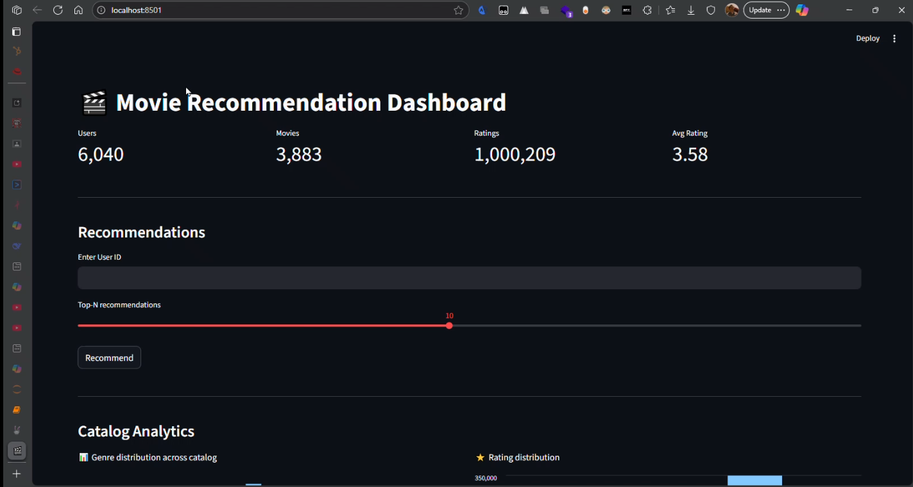

# MovieLens LakeHouse Pipeline


This project implements a MovieLens LakeHouse pipeline demonstrating modern data engineering practices.

## Pipeline Explanation

The project follows a multi-layered data lakehouse architecture, processing data in both batch and streaming modes.

1.  **Data Sources**:
    *   **Batch Data**: Historical data including movie details and user information.
    *   **Streaming Data**: Real-time user ratings for movies.

2.  **Ingestion**:
    *   **Airflow**: Orchestrates the batch ingestion of historical data from local files into the MinIO-based data lake.
    *   **Kafka**: Captures and streams real-time user ratings.

3.  **Storage (MinIO Data Lake)**:
    *   **Bronze Layer**: Stores raw, unaltered data ingested from the sources.
    *   **Silver Layer**: Contains cleaned, validated, and enriched data after initial processing.
    *   **Gold Layer**: Holds aggregated and curated data, ready for analytics, reporting, and machine learning.

4.  **Processing**:
    *   **Spark**: The core processing engine. It handles:
        *   Real-time processing of the Kafka stream.
        *   Batch transformations to move data from Bronze to Silver and Silver to Gold layers.
        *   Interaction with the Iceberg catalog for reliable data management.

5.  **Data Catalog**:
    *   **Iceberg**: Manages the data lake tables, providing ACID transactions, schema evolution, and time travel capabilities.

6.  **Analytics and Visualization**:
    *   **Trino**: A high-performance, distributed SQL query engine used to query data directly from the Iceberg tables for analytics.
    *   **Streamlit**: Powers an interactive web application for data visualization and presenting movie recommendations.
    *   **Keras**: Used to train a recommendation model on the Gold layer data, which is then served via the Streamlit app.

## Streamlit App Demo

[](images/demo.mp4)


---

## Setup

1.  **Prerequisites**:
    *   Docker
    *   Python 3.9+

2.  **Clone the repository**:

    ```bash
    git clone <repository_url>
    cd "MovieLens"
    ```

3.  **Environment Variables**:

    Copy the example environment file and modify as needed:

    ```bash
    cp .env.example .env
    ```

4.  **Install Python Dependencies**:

    ```bash
    make setup
    ```

## Usage

### Start Services

To start all services (Kafka, Zookeeper, Minio, Spark, Airflow):

```bash
make up
```

### Stop Services

```bash
make down
```

### View Logs

```bash
make logs
```

## Project Structure

```
project-root/
├── src/                 # Source code for ingestion, streaming, processing, config, utils
├── tests/               # Unit and integration tests
├── airflow/             # Airflow DAG definitions and plugins
├── docker/              # Dockerfiles and configurations for services
├── notebooks/           # Jupyter notebooks for ML experiments and EDA
├── Data/                # Raw data files (MovieLens dataset)
├── docs/                # Project documentation
├── docker-compose.yml   # Docker Compose orchestration file
├── requirements.txt     # Python dependencies
├── .env.example         # Template for environment variables
├── .gitignore           # Git ignore rules
├── Makefile             # Common commands
└── README.md            # Project documentation
```

## Development

### Running Tests

```bash
make test
```

### Linting and Formatting

```bash
make lint
make format
```

## Documentation

Refer to the `docs/` directory for detailed architecture, setup, and development guides.